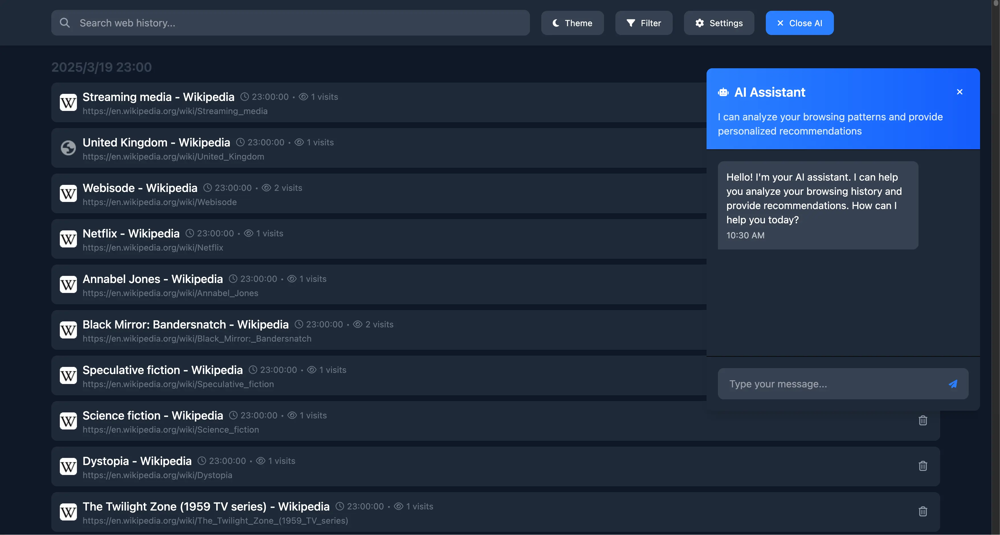

  
  <h1>Rearview</h1>
  
Enhance Your Browsing History Experience

  <a href="README.md">English</a> | <a href="README.zh.md">简体中文</a>

## ✨ Features

<!-- - **Long-term Storage**: Break through browser default limitations, save months or even years of history records locally. -->
- **Full-text Search**: Search not just URLs and titles, but also the content of web pages you've visited.
- **Timeline View**: Display your browsing history along a timeline, organize and filter by date, domain, or visit frequency.
- **AI Assistant**: Intelligent conversation services based on your browsing history.

## 🚀 Getting Started
> ***Chrome Web Store & Microsoft Edge Add-ons & Firefox Add-ons:***

&nbsp&nbsp&nbsp    

&nbsp&nbsp&nbsp    

> ***Or you can install beta version(will be another extension instance) via:***
1. Download the latest Beta release zip from [GitHub Releases](https://github.com/Rearview-ai/extension/releases).
#### 🌐 Chrome / Edge
2. Visit `chrome://extensions` or `edge://extensions` 
3. Enable `Developer Mode`
4. Drag and drop the downloaded zip file onto the extensions page
#### 🦊 Firefox
2. Visit `about:debugging#/runtime/this-firefox`
3. Click `Load Temporary Add-on...`
4. Select `manifest.json` from zip extracted folder.
   
## 📸 Screenshot

  

## 🛡️ Privacy & Security

We take your privacy and data security seriously :

- **Local Storage**: All your browsing history is stored locally on your device
- **No Data Collection**: We don't collect or transmit your browsing data
- **Transparent Policy**: Our privacy policy is clear and user-focused

For detailed information about our privacy practices, please visit our [Privacy Policy](https://rearview-ai.vercel.app/privacy).

