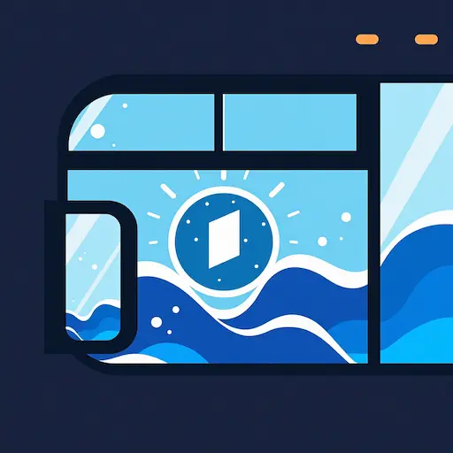
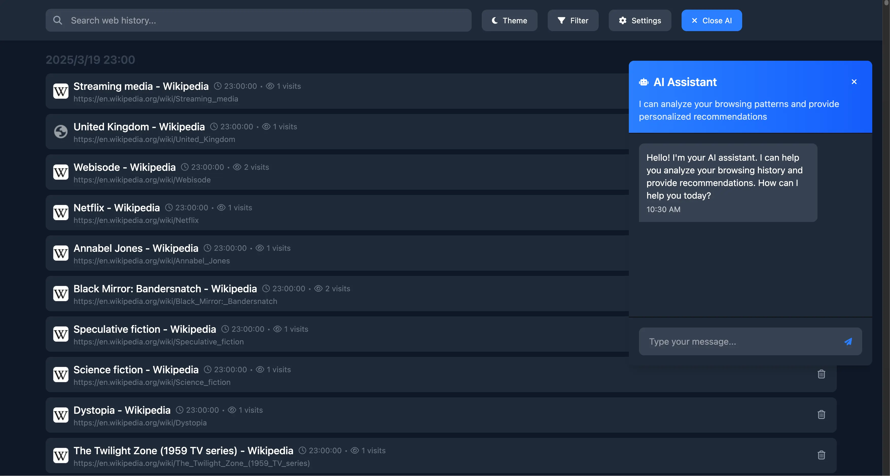

  
  <h1>Rearview</h1>
  
增强你的浏览历史体验

  <a href="README.md">English</a> | <a href="README.zh.md">简体中文</a>

## ✨ 特性

- **长期存储**：突破浏览器默认限制，在本地保存数月甚至数年的历史记录。
- **全文搜索**：不仅可以搜索 URL 和标题，还能搜索你访问过的网页内容。
- **时间线视图**：沿时间线展示你的浏览历史，按日期、域名或访问频率进行组织和筛选。
- **AI 助手**：基于你的浏览历史提供智能对话服务。

## 🚀 开始使用
> ***Chrome Web Store & Microsoft Edge Add-ons:***

&nbsp&nbsp&nbsp    

> ***或者可以通过以下步骤安装beta版本:***
1. 从 [GitHub Releases](https://github.com/livin2/rearview-extension/releases) 下载最新版本
2. 打开 Chrome/Edge 并访问 `chrome://extensions` 或 `edge://extensions`
3. 在右上角启用"开发者模式"
4. 将下载的 `.zip` 文件拖放到扩展页面
5. 点击浏览器工具栏中的扩展图标，开始探索你的浏览历史
6. 享受增强的历史管理功能

## 📸 截图

  

## 🛡️ 隐私与安全

- 所有历史索引数据都存储在你的本地设备上
